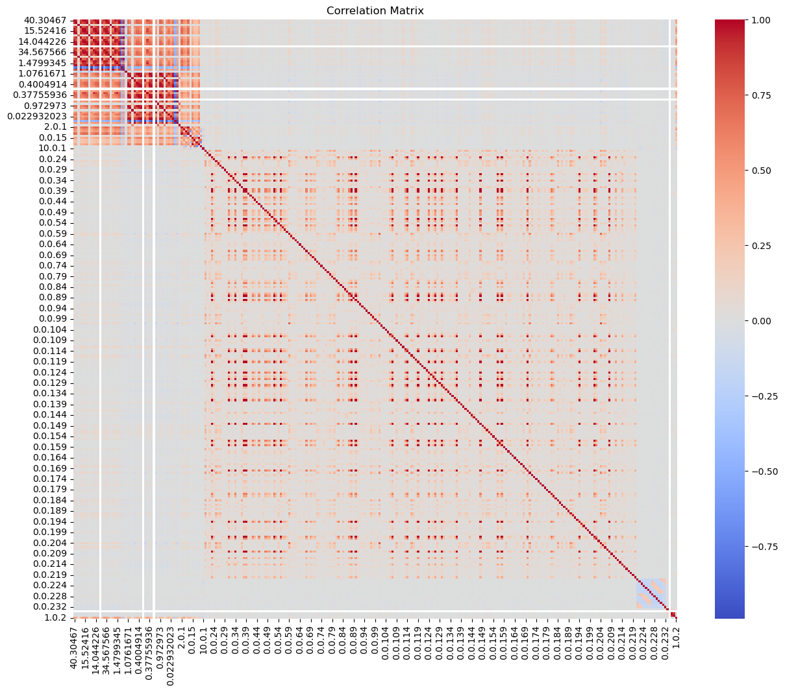
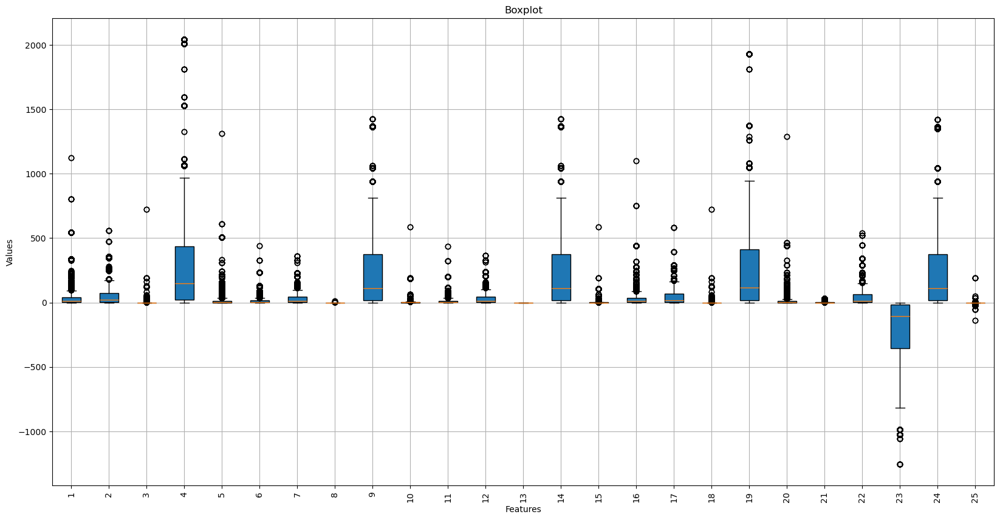
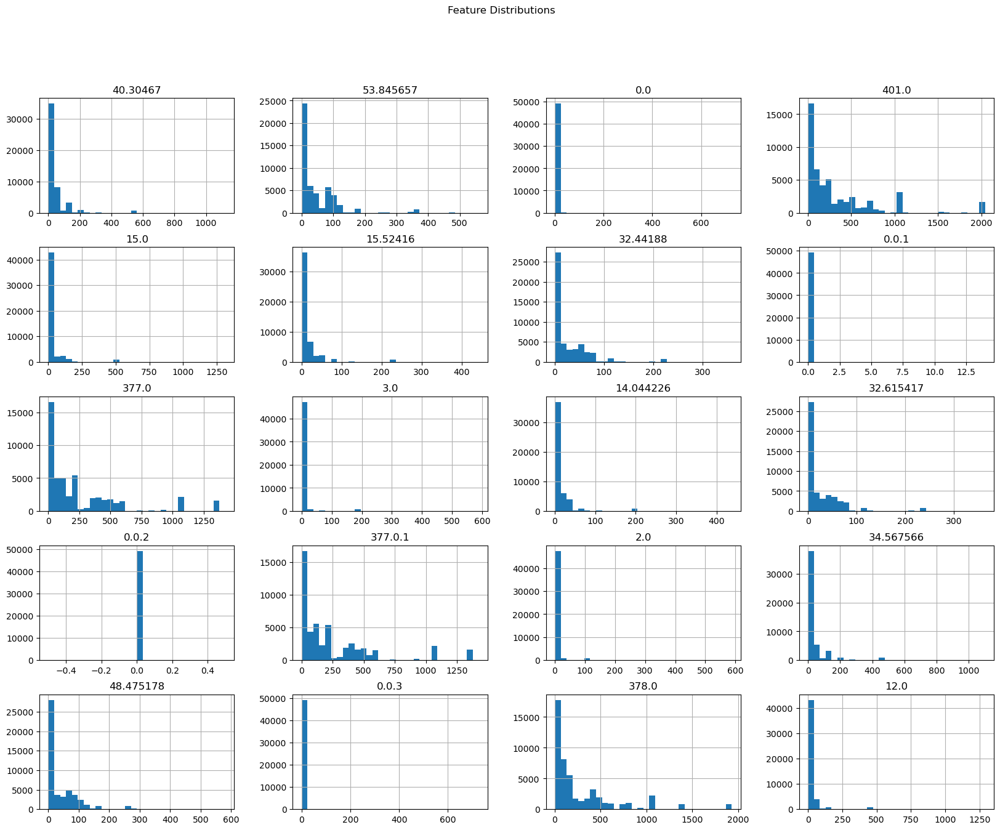
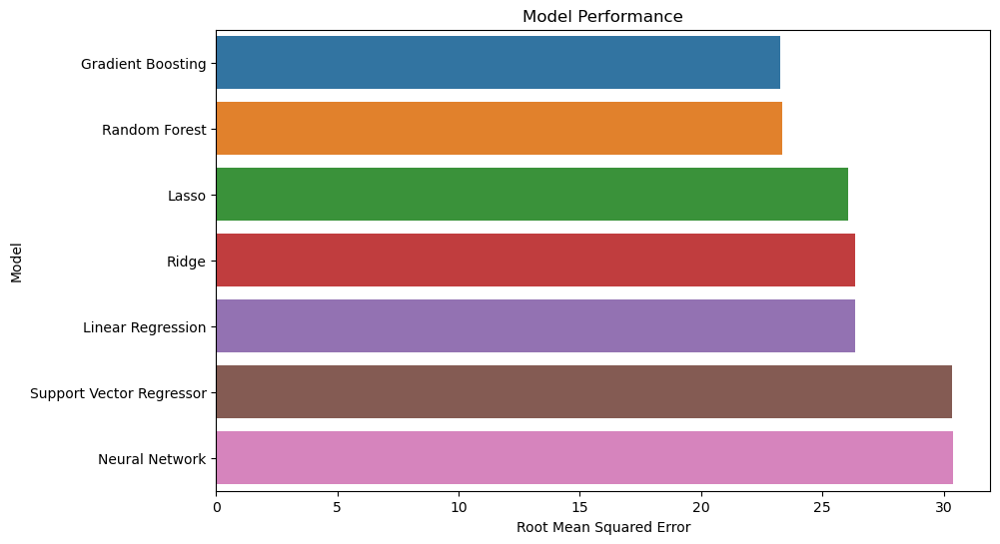
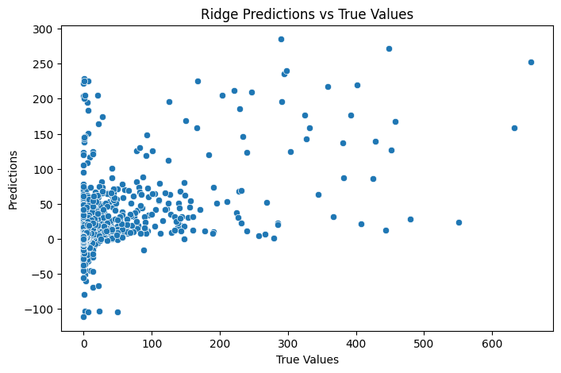
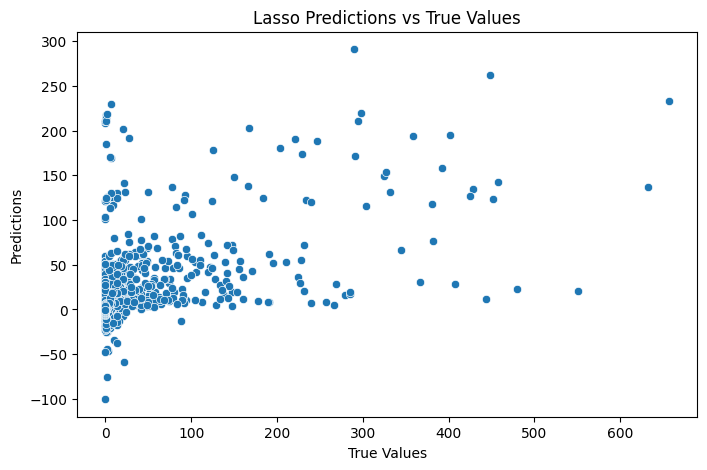
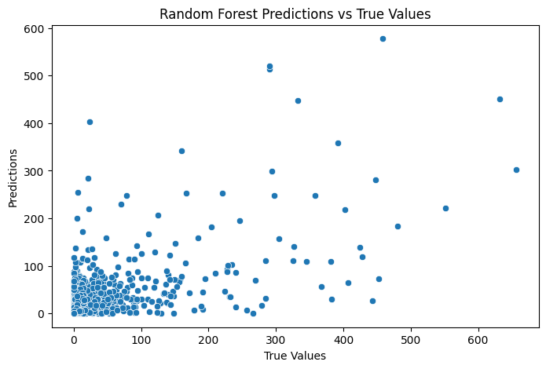
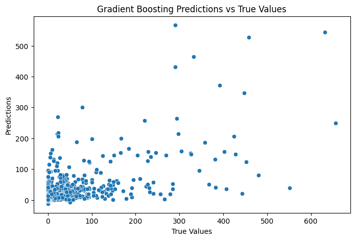
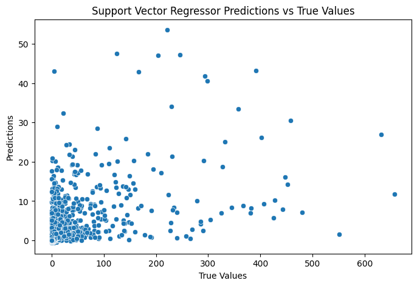
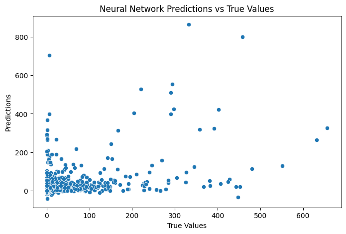

# Data Analysis Project @Univaq

This repository contains a machine learning project that aims to predict the number of comments a blog post will receive in the next 24 hours. The data set comes from blog posts, and from the information available at the time of publication, we try to predict how many comments the post will receive in a 24-hour period.

## Table of Contents
- [Dataset Information](#dataset-information)
- [Dependencies](#dependencies)
- [Project Structure](#project-structure)
- [Implementation Details](#implementation-details)
- [Results](#results)
- [Conclusion](#conclusion)
- [Images](#images)

## Dataset Information

This data originates from blog posts. The raw HTML-documents of the blog posts were crawled and processed.

The prediction task associated with the data is the prediction of the number of comments in the upcoming 24 hours.

- In the train data, the base times were in the years 2010 and 2011.
- In the test data the base times were in February and March 2012.

Attributes:
- 1…50: Average, standard deviation, min, max, and median of the Attributes 51…60 for the source of the current blog post.
- 51…60: Features related to the number of comments and links (trackbacks).
- 61: The length of time between the publication of the blog post and base time.
- 62: The length of the blog post.
- 63…262: The 200 bag of words features for 200 frequent words of the text of the blog post.
- 263…276: Binary indicator features (0 or 1) for the weekday of the basetime and publication date.
- 277: Number of parent pages.
- 278…280: Minimum, maximum, average number of comments that the parents received.
- 281: The target: the number of comments in the next 24 hours (relative to base time).

## Dependencies

- Python 3.x
- NumPy
- Pandas
- Scikit-learn
- Seaborn
- Matplotlib

## Project Structure

- `data/` - Directory containing the CSV files of the dataset.
- `Dataset Zip/` - Directory containing zipped dataset files.
- `Documentation/` - Directory containing project documentation files.
- `output_images/` - Directory containing images used in the README.
- `BlogPost-Comment-Analysis.ipynb` - Notebook that contains the main code of the project.
- `README.md` - Markdown file containing the project overview and instructions.
- `.gitattributes` - Git attributes configuration file.
- 

## Implementation Details

The project includes experimentation with several regression models to predict the number of comments. Models include:

- Linear Regression
- Ridge
- Lasso
- Random Forest Regressor
- Gradient Boosting Regressor
- Support Vector Regressor
- Neural Network

Preprocessing of the data was performed, including feature scaling. Each model was then trained using the training set and its performance was evaluated using metrics such as root mean square error and R2 score. In addition, the results were visualized using graphs.

## Results

### Correlation Matrix

### Boxplot

### Feature Distributions

### Model Performance

### Linear Regression Predictions vs True Values

### Ridge Predictions vs True Values

### Lasso Predictions vs True Values

### Random Forest Predictions vs True Values

### Gradient Boosting Predictions vs True Values

### Support Vector Regressor Predictions vs True Values

### Neural Network Predictions vs True Values

## Conclusion

### Observations
- **Linear Regression**: Struggles with high variance in predictions.
- **Ridge Regression**: Slight improvement over linear regression but still high variance.
- **Lasso Regression**: Similar to Ridge, with some feature selection capabilities.
- **Random Forest**: Shows better performance with less variance.
- **Gradient Boosting**: Best performance in terms of accuracy and variance reduction.
- **Support Vector Regressor**: Moderate performance with specific kernel functions.
- **Neural Network**: Capable of capturing complex patterns but may overfit with small data.

### Dataset Analysis
- The dataset is characterized by high variability in the number of comments.
- Features show varying levels of correlation with the target variable.
- Standard deviation among features indicates significant spread, necessitating normalization and careful model tuning.

## Future Work
- Expanding the dataset with more diverse sources can improve model generalization.
- Exploring other machine learning models and deep learning architectures.
- Further feature engineering to extract more informative features.

### Summary
This project demonstrates the use of various regression techniques to predict the number of comments on blog posts. Gradient Boosting showed the best performance, indicating its robustness in handling this dataset. Further improvements can be achieved by enhancing the dataset and exploring advanced modeling techniques.

## Images

All images used in this README are stored in the `output_images/` directory for reference.

---

This project is part of the Data Analysis course at Univaq.
